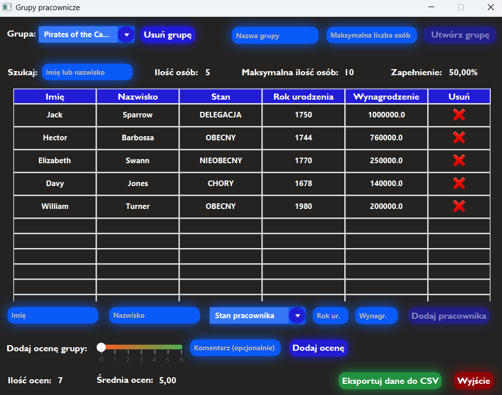

# Employee group management
### Employee group management in Java using JavaFX and Hibernate

This application is my school project and is used to manage employee groups.

The application was written in Java using JavaFX (for graphical aspects). I used the Hibernate framework to communicate with the database. 

The application is in Polish language.

Application features (everything has a data validation):
* adding and removing employee groups
* adding and removing employyee in group
* list of employees in the group
* editing employee data
* searching for an employee by part of their name or surname
* group statistics (number of people, maximum number of people, percentage of occupancy)
* possibility to add a rating to the group
* insight into group rating statistics
* ability to export data to a csv file (groups, employees, ratings)

Screenshot of an example employee group in the application:

